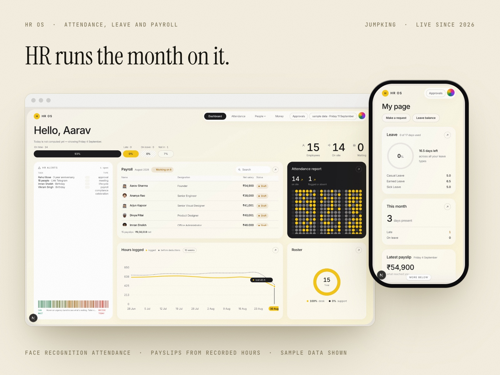

# HR OS

**Attendance, leave and payroll for a fifteen person company, driven by a face recognition terminal. Product design and build, Jumpking, 2026.**

Attendance at a fifteen person company was one person’s job in HR, done by hand, every month.

## What Was Being Done by Hand

HR tracked who came in, who was late and who took leave, and then turned all of it into pay. It worked, in the sense that people got paid. It also cost a real part of somebody’s month, and every hour of it went on writing down facts that the front door already knew.

I have no measured figure for how long it took, so there is not one in this case study. What I can say is that it was manual from end to end, and that the mistakes it could produce were the kind that end in a conversation about somebody’s pay.

## The Reason We Did Not Just Buy One

We looked at the products that already do this. They are real, they work, and for most companies this size buying one is the right answer.

Two things I checked on Zoho People’s own pricing page on 4 September 2026: every paid plan carries a minimum of five users, and the attendance features this actually needed, biometric integrations, attendance regularization, on duty and hourly permissions, are absent from the lower plans, with attendance management starting at Professional rather than Essential HR.

The honest reason we did not buy is simpler than a feature table. The company had decided it wanted a terminal, and I said I could build the software around it. The engineering time was already in the building. A bought product would have been running inside a week and this took considerably longer, so what we traded was time then, for a system that matches how this company actually pays people.

## The Terminal Does Not Know Who Anyone Is

The face terminal assigns its own user numbers and they are not employee codes. Face ID 1 turned out to be employee code 5. The only field the two systems share is the name, so the bridge matches on the name.

Matching people is the one operation here I did not let run unattended. An enrolment decides whose attendance a punch becomes, and therefore whose pay it affects. So the matcher reports by default and writes only when it is given an apply flag, and anything ambiguous is left on the enrolment screen for a person to resolve. It is slower every time somebody joins, and that is the trade I wanted.

## Built for a Device That Does Not Cooperate

Most of the engineering is defensive, because the terminal is not a well behaved peer.

Punch ingestion is idempotent on a unique natural key, so the push listener and the five minute backfill can both deliver the same event, in any order, any number of times, without a day being counted twice

The listener answers 200 before it does any work, because the device drops an event entirely if the reply is slow

The digest client is hand written against RFC 2617, because Node’s fetch has no digest support, and it never retries a 401 more than once, because the admin account locks for around thirty minutes after roughly five failed attempts

Non punch events are filtered out before user IDs are derived. A real terminal interleaves operation and alarm events carrying no employee number, and mapping over the unfiltered list took the whole backfill down. The mock never emitted those, so this only ever appeared against real hardware

Punches are append only, and they are the evidence trail when somebody disputes their pay. The attendance day is derived from them and always recomputed, never authored. If the derivation is wrong it can be rebuilt. If the punches were editable there would be nothing left to rebuild from.

## English Only, On Purpose

The Telegram bot is the interface for people who do not sit at a computer, and its strings were English only for a long time by choice.

An earlier machine translation rendered “Apply for leave” into Kannada using a word that is not the Kannada for leave. Hindi, Nepali and Kannada exist now, but they are marked unverified until a speaker signs them off, English stays the default, and a person sees another language only after choosing it. Fewer languages, deliberately, because a wrong word on the button that takes your leave is worse than an English one.

The whole system runs on one machine inside the office, so the bot uses long polling rather than webhooks. There is no public URL to point a webhook at.

## It Used to Be Dark, and That Was Wrong

The first version was a dark interface with a bright green accent. It looked like the kind of software I enjoy looking at, and it was the wrong answer for this building.

This is a system somebody reads under office lighting, next to paper, for an hour at a time, to decide what fifteen people get paid. So it was rebuilt onto a warm cream plane with white cards and a single gold accent, and every page became a grid of compact cards rather than a stack of full-width bands. The same pass cut the navigation from seven slots to four, because seven was a menu I had designed for the feature list rather than for the four things anyone actually does here.

The screenshots on this page are from after that rebuild. Throwing away a finished interface is expensive and I would rather show the one that is in front of people.

## Where It Stands

It is live. Staff scan their faces at the door, HR runs the month on it, and payslips are generated from the hours the terminal recorded rather than from anything anyone typed. That was the whole point: the door already knows, so nobody should have to write it down twice.

The screenshots here come from the demo database rather than the live one, which holds a real roster with encrypted identity documents. Every screen carries a sample data badge, because the product says so itself.

What is still rough is the language work. Hindi, Nepali and Kannada remain unverified, so English is what almost everyone still sees.

*An employee’s own page on a phone, showing leave available, days present this month, latest net pay and the requests they can make*

---

Designed by **Anurag Adhikari** · Anurag Studio · [anurag.studio](https://anurag.studio/work/hr-os) · hello@anurag.studio
